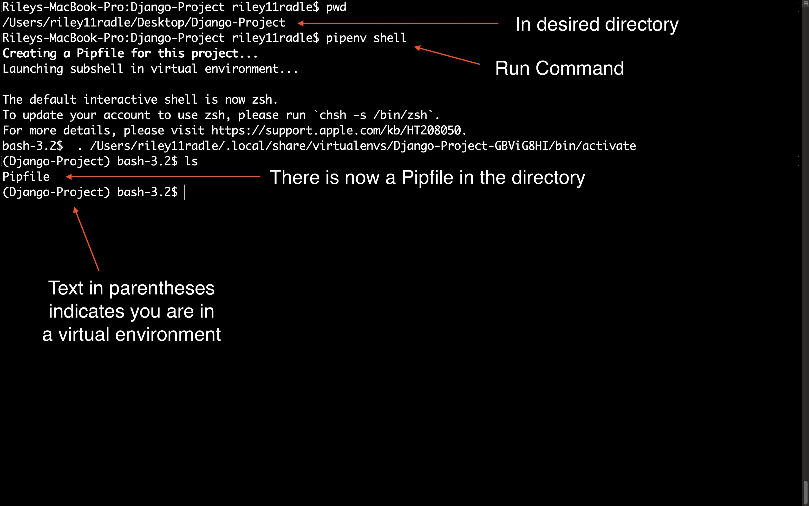
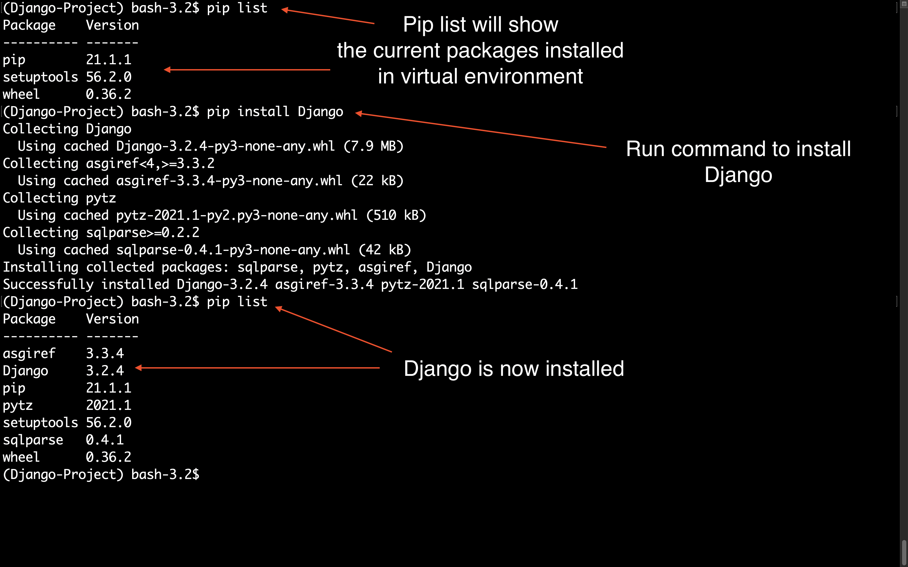
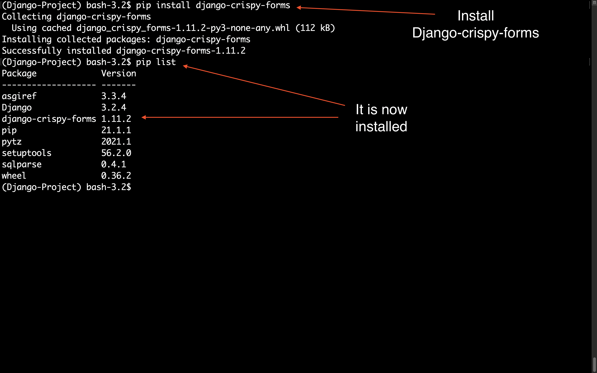
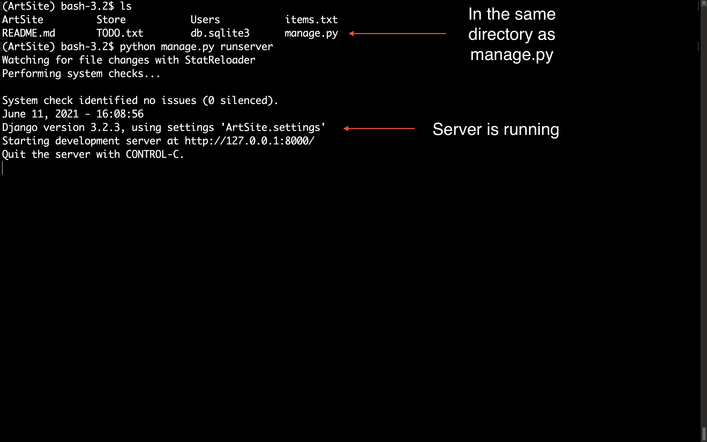
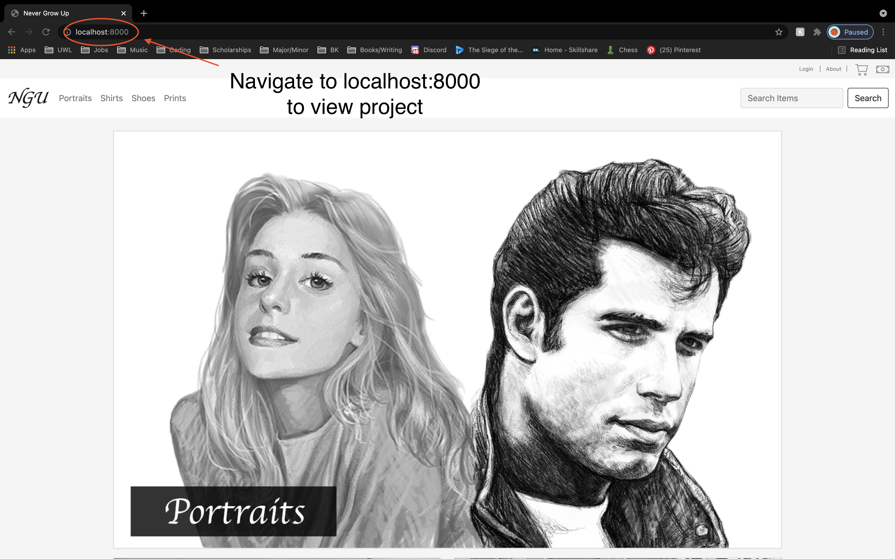
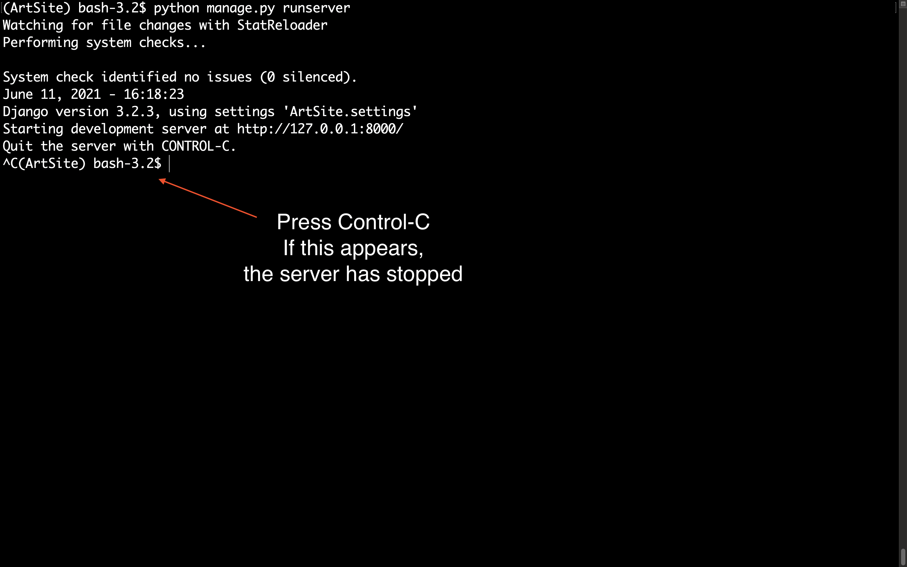

# *Artsite*

## Description
__*A personal store to "promote and sell" my art*__  
For this project, I created an online store that could eventually be used to 
sell art that I create.  I love to draw and have thought about creating pieces
to sell, so I figured this would be a great project to start my portfolio.
The website allows users to browse for items via a category system,
or directly search for items that are stored in the website's database.  They are also
able to register and log into the website, as well as add and remove items from their cart.
Because the website is unfinished, there is no way for a user to checkout and buy the items.  
  
**Resources Used**  
-Python 3  
-HTML5  
-CSS  
-Django  
-Photoshop  

# Future Add-Ons
1. *Check out feature*   
Implement the checkout page so users can actually place an order  

2. *Better Search System*
Implement a better way to query the database for items  
Potentially use AI to predict / allow for incorrect spelling  

3. *Better cart system*  
Associate the cart with a specific user, rather than just a list  
This would make it easier for handling multiple requests  

4. *More items and categories*  
Add more content to the store  
Use my own content / products  

5. *More custom CSS*  
Add more of my own CSS to stylize the site more  
Right now it uses very basic bootstrap  

6. *Utilize the login / registration*  
Take advantage of the login and registration for
the user to checkout, have their own specific cart
etc.  

7. *Better images*  
Use more consistently sized and styled pictures to make
the spacing or theme of the site more cohesive  
Use photoshop to make the images look nicer or remove backgrounds  

8. *Settings*  
Add a feature so the user can change the settings of the app. Some settings could include:  
-Dark/Light Mode  
-Filters  
-View/Change User Information  
-etc  

# **Running / Viewing the Project**

## 1. Navigate to the correct directory
a. Once you have downloaded the source files, open a terminal / command prompt  
b. Use the command *cd [folder_name]* to navigate through your file system  
c. Navigate to the directory that contains **manage.py**  

## 2. Install the needed python packages
a. I recommend using a virtual environment for this  
&nbsp;&nbsp;&nbsp;( here is a quick video explaining pipenv if unfamiliar: https://www.youtube.com/watch?v=K2fNEoZfuy8 )  
b. Install django and django-crispy-forms (enter the commands below)  
&nbsp;&nbsp;&nbsp;$ python -m pip install Django  
&nbsp;&nbsp;&nbsp;$ pip install django-crispy-forms  
c. **NOTE** Depending on your computer you may need to use python3 and pip3 instead of python and pip  
d. **This project uses Python 3**  

## 3. Enter the runserver command
a. In the same directory as manage.py, enter the command below  
&nbsp;&nbsp;&nbsp;$ python manage.py runserver  
b. If the program ran without errors, the following text should appear in the terminal / command prompt:  
  
&nbsp;&nbsp;&nbsp;**System check identified no issues (0 silenced).**  
&nbsp;&nbsp;&nbsp;**June 11, 2021 - 15:14:15** 
&nbsp;&nbsp;&nbsp;**Django version 3.2.3, using settings 'ArtSite.settings'**  
&nbsp;&nbsp;&nbsp;**Starting development server at http://127.0.0.1:8000/**  
&nbsp;&nbsp;&nbsp;**Quit the server with CONTROL-C.**  

## 4. View the Project
a. Open a web browser  
b. Enter 'http://127.0.0.1:8000/' or 'localhost:8000' into the search bar  
c. This should take you to the home page of the store  
   and will run as long as the server is running without errors

## 5. Stop the server
a. From the terminal / command prompt  
&nbsp;&nbsp;&nbsp;-Press Control-C

# Examples / Screenshots  
## Pipenv
### Running pipenv

## Installing packages 
### Install Django  

### Install Crispy Forms  

## Running the project
### Running the Server

### The Project 

### Stopping the Server

   

<small>  

__*@Author: Riley Radle*__  
Check out my socials!  
*Instagram*: https://www.instagram.com/riley_radle/  
*Artstation*: https://www.artstation.com/gatoradle11/    
*Linkedin*: https://www.linkedin.com/in/riley-radle-00a4a0184/

</small>

